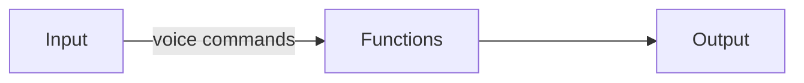

# Virtual Assistant with Python 

### Project description
Virtual assistant for computer developed in Python, which recognises voice commands and executes the function given for that command.


Example: 



### Library Reference

for this project we have used the Python [speechRecognition](https://pypi.org/project/SpeechRecognition/) library which provides us with a speech recognition service.
In this particular project the engine/API used was that of google, which does not require a Key API.

### Requirements 

all libraries used in the project are in the **requirements.txt file**.

### Structure 

```
project
│   README.md
│   requirements.txt    
│   app.py
│
└───SPT
│   │   spt.py
│   │   terms.py
│   
└───Functions  
│   │   translator.py
│   │   time.py
│   │   search.py
│   │   userName.py
│
└───Test_SPT
│   │   test_spt.py
│   │   test_terms.py
│   
└───Test_Functions  
│   │   test_translator.py
│   │   test_time.py
│   │   test_search.py
│   │   test_userName.py
```