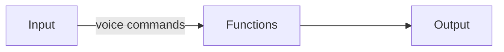

# Virtual Assistant with Python 

### Project description
Virtual assistant for computer developed in Python, which recognises voice commands and executes the function given for that command.


Example: 



### Library Reference

for this project we have used the Python [speechRecognition](https://pypi.org/project/SpeechRecognition/) library which provides us with a speech recognition service.
In this particular project the engine/API used was that of google, which does not require a Key API.

### Requirements 

all libraries used in the project are in the **requirements.txt file**.
to install it:

```python 
$ pip install -r requirements.txt
```

### Structure 

```
project
│   README.md
│   requirements.txt    
│   app.py
│   .gitignore
│
└───SPT
│   │   spt.py
│   │   terms.py
│   
└───Functions  
│   │   translator.py
│   │   time.py
│   │   search.py
│   │   userName.py
│
└───Test_SPT
│   │   test_spt.py
│   │   test_terms.py
│   
└───Test_Functions  
│   │   test_translator.py
│   │   test_time.py
│   │   test_search.py
│   │   test_userName.py
```

### Quickstart

#### **how it works**

In the project there are four directories of which we are going to ignore the directories that start with test, as they contain the unit tests.
There is also a file called app.py, which we will describe later. 

**SPT** contains two files;
1. **spt.py** contains the Assistant, and the Speech Interpreter(voices).
2. **terms.py** contains a dictionary with several dictionaries of lists. Each list within the dictionary contains the terms that the Assistant will understand in order to execute the corresponding function.

**Functions** currently contains 4 files;

the main idea of this directory is to add the functions that we want the Assistant to execute.
with this directory we separate the Assistant from the functions to get a cleaner and more readable code.

1. translator.py
2. time.py
3. search.py
4. userName.py

**app.py** 

is the main file of the project and is where the project is executed from.
In this file we instantiate our classes (SPT, Functions) and create new objects in order to start our Virtual Assistant.


### Authors
```
Ronny Anchaluisa
```


